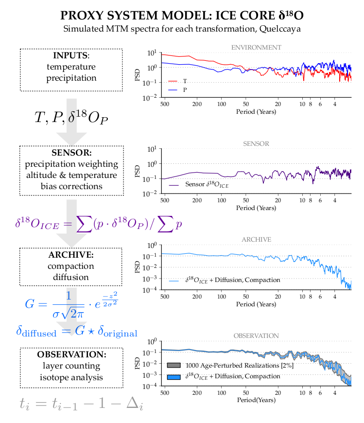
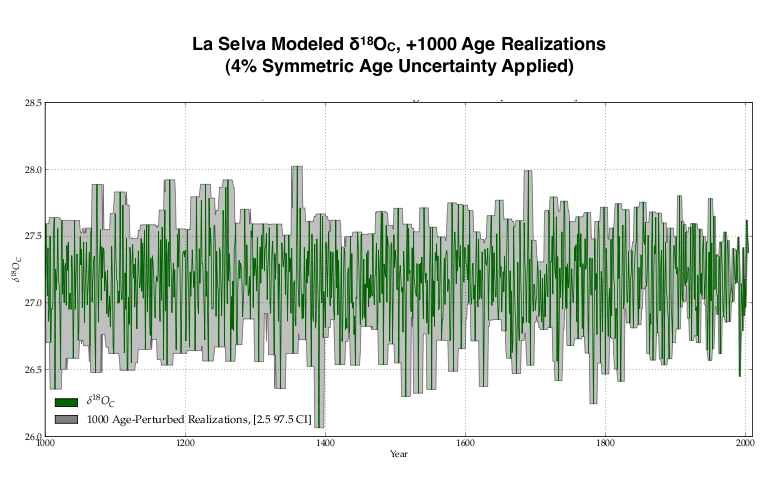

=======
PRYSM
=====
open-source tools for PRoxY System Modeling, v1.0: oxygen-isotope systems

Introduction
---------------------------
The paper, published in JAMES: http://onlinelibrary.wiley.com/doi/10.1002/2015MS000447/full

Proxy system modeling can be used in paleoclimatology to improve the interpretation of 
paleoclimate data. Existing forward models for climate proxies are somewhat scattered in 
the literature, making their integration difficult. Further, each model has been coded 
separately, according to disparate conventions. Here, we present a comprehensive, consistently 
formatted package of forward models for water-isotope based climate proxies (ice cores, corals, 
tree ring cellulose, and speleothem calcite) [PRYSM]. This suite of Python-scripted models requires
a standard set of climate inputs and can be used to simulate the proxy variable of interest by proxy class. 
By making this forward modeling toolbox publicly available, PRYSM provides an accessible platform that maximizes
the utility of proxy data and facilitates proxy-climate (simulated or historical) comparisons. Many of these codes 
have been employed in past studies; we review modeling approaches for each proxy class, and compare 
results when forced with an isotope-enabled climate simulation. Applications of multi-proxy forward 
modeling including parameter estimation, the effects of physical processes (such as karst transit times 
or firn diffusion in ice cores) on the simulated climate signal, as well as explicit modeling of 
time uncertainties are used to demonstrate the utility of PRYSM for a broad array of climate studies. 

Dependencies
---------------------------
python 2.7 (https://www.python.org/download/releases/2.7/)

numpy (http://www.numpy.org/)  
scipy (http://www.scipy.org/)  
rpy2 (http://rpy.sourceforge.net/) (For BCHRON)  

Optional:
  matplotlib (http://matplotlib.org/) (For plotting tools)
  

Installation
---------------------------
Make sure the dependencies are installed, then download and unzip this package, and then:  
  python setup.py install

Alternately, you can use pip:  
  pip install git+https://github.com/sylvia-dee/PRYSM.git

Either method will add a module named 'psm' to your default lib/python2.7/site-packages/ directory.

If you lack root access:  
 python setup.py install --user
 
For git users:
 git clone https://github.com/sylvia-dee/PRYSM.git
 python setup.py install

Testing
---------------------------
From the examples/ directory, run each of the example driver scripts and each of the plotting examples. For just the icecore example:  
python icecore_driver.py  

This will create numpy array output files in examples/results/:  
ice_Xn.npy
ice_time_d.npy
ice_depth.npy
ice_diffused.npy

To plot (requires matplotlib):  
python plot_icecore_example.py

This will reproduce paper figure 3.
